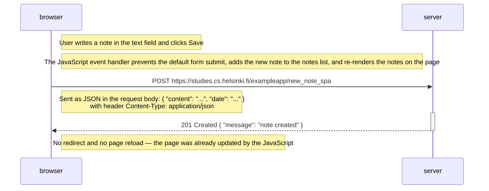

# Exercise 0.6: New note in Single page app diagram

Sequence of events when the user creates a new note using the single-page
app version at `https://studies.cs.helsinki.fi/exampleapp/spa` by writing
into the text field and clicking **Save**.

